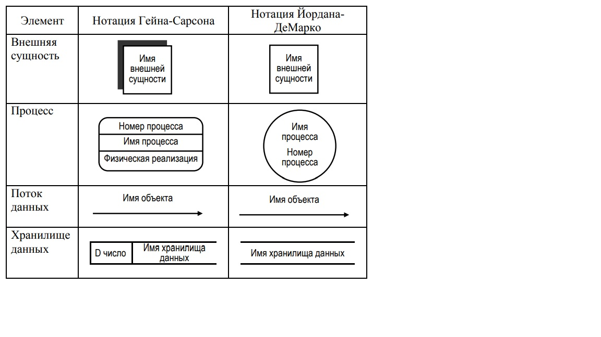

# Методология моделирования потоков данных DFD

1. Как определяется система в соответствии и методологией моделирования потоков данных (DFD)?

Модель системы представляется как иерархия диаграмм потоков данных, описывающих асинхронный процесс преобразования информации от момента ввода ее в систему до выдачи конечному пользователю. Методология моделирования потоков данных показывает функции верхнего уровня и их взаимодействия через материальные или информационные потоки. Методология DFD не делает акцента на последовательности выполнения функций во времени.

2. Дайте краткую характеристику основных элементов диаграммы потоков данных (DFD): внешние сущности, процессы, потоки данных, хранилища данных. Приведите примеры.

**Внешняя сущность** -  это материальный объект или физическое лицо, выступающее в качестве источника или приемника материальных или информационных объектов. Всегда находится за пределами границ анализируемой системы. Может присутствовать в нескольких экземплярах для удобства.

**Процесс** - это преобразование входных материальных или информационных потоков в выходные в соответствии с 
определенным алгоритмом. 
Номер процесса служит для его идентификации.
Имя процесса рекомендуется формировать в следующем порядке. В начале указывается действие, выполняемое процессом. Действие 
описывается активным недвусмысленным глаголом в неопределенной. За действием указывается объект, над которым действие осуществляется. Объект описывается существительным в винительном падеже.
Информация в поле физической реализации показывает, кто или что (программа, подразделение организации, аппаратное устройство или др.) выполняет данный процесс, например, бухгалтерия

**Поток данных** определяет материальные или информационные объекты, передаваемые от источника к приемнику. 

**Хранилище данных** (или накопитель данных, data store) – это абстрактное устройство для хранения материальных или информационных объектов.

3. Опишите процесс построения иерархии диаграмм потоков данных (DFD).

На первом этапе построения иерархии диаграмм потоков данных создается контекстная диаграмма, которая определяет границу 
системы. На контекстной диаграмме изображаются: основная функция системы, внешние сущности, материальные или информационные потоки, которыми обмениваются система и внешние сущности.
При проектировании простых систем строится единственная контекстная диаграмма с топологией в форме звезды. В центре такой диаграммы находится главный процесс (основная функция системы), соединенный с внешними сущностями материальными или информационными потоками.
Для сложных систем строится несколько иерархически упорядоченных контекстных диаграмм. Контекстная диаграмма верхнего уровня содержит набор подсистем, соединенных материальными или информационными потоками. Контекстные диаграммы следующего уровня детализируют подсистемы.
