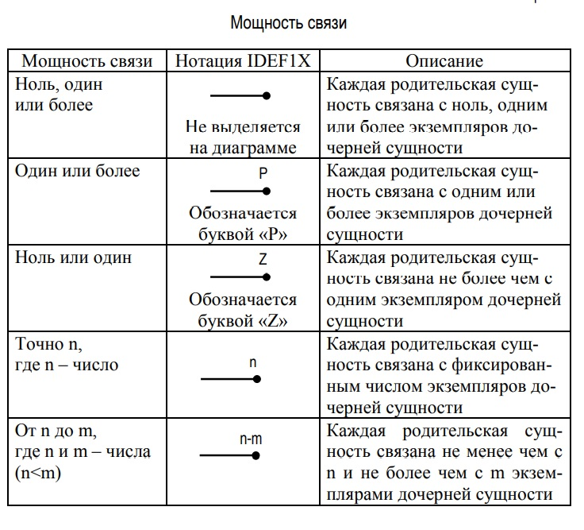

## Моделирование данных. Методология IDEF1X

9.1. Моделирование данных. Методология IDEF1X
1.	Что описывает сущность в методологии IDEF1X? Приведите пример сущности. Дайте определение понятия «атрибут» сущности. Как сущность изображается на диаграмме (имя сущности, ключевая и неключевая области)?

**Сущность** в IDEF1X описывает множество объектов, обладающих схожими свойствами, но однозначно отличаемых друг от друга по одному или нескольким признакам. Конкретный объект называют экземпляром сущности. 
**Атрибут** – любая характеристика сущности, значимая для рассматриваемой предметной области и предназначенная для квалификации, идентификации, классификации, количественной характеристики или выражения состояния сущности.

На диаграмме сущность изображается прямоугольником, содержащим список атрибутов сущности. Над прямоугольником помещаются уникальное имя сущности и ее номер, разделяемые косой чертой «/».
Прямоугольник, отображающий сущность, разделяется горизонтальной линией на две части. В верхней части прямоугольника,называемой ключевой областью, расположены атрибуты, составляющие первичный ключ. В нижней части прямоугольника, называемой областью данных, расположены прочие, неключевые атрибуты

2.	Дайте определения следующих понятий (в методологии IDEF1X): ключевой атрибут, описательный (неключевой) атрибут, первичный ключ, внешний ключ. Какие правила установлены для атрибутов входящих в первичный ключ? Как различные виды атрибутов изображаются на диаграмме?

**Ключевые атрибуты** – это атрибуты, предназначенные для однозначной идентификации каждого экземпляра сущности и позволяющие отличить один экземпляр сущности от другого (совокупность признаков, позволяющих однозначно идентифицировать объект).

**Первичный ключ** сущности – это набор атрибутов, выбранных для идентификации уникальных экземпляров сущности.
Установлены следующие правила для атрибутов, входящих в первичный ключ:
- атрибут должен уникальным образом идентифицировать экземпляр сущности;
- атрибут не должен использовать NULL значений;
- атрибут не должен изменяться со временем;
- имя атрибута должно быть как можно более коротким.

**Внешние ключи** – это атрибуты первичных ключей родительской сущности, переданные дочерней сущности через их связь.

**Описательные или неключевые атрибуты** – это атрибуты, которые не выбраны ключевыми. Описательные атрибуты бывают обязательными или необязательными. Обязательные атрибуты для каждой сущности всегда имеют конкретное значение, необязательные – могут быть не определены.

3.	Что представляют собой связи в методологии IDEF1X? Что позволяют отобразить связи на диаграмме? Какие сущности называются дочерними, а какие родительскими? Как изображаются дочерние и родительские сущности на диаграмме? В каком случае связь называется идентифицирующей, а в каком неидентифицирующей? Как изображаются идентифицирующая и неидентифицирующая связи на диаграмме?

**Связи** представляют собой ссылки, соединения и ассоциации между сущностями. 
Связь позволяет отобразить следующую информацию: тип связи (идентифицирующая, неидентифицирующая), родительский конец связи, дочерний конец связи, знак обязательности связи, мощность связи, имя связи.

Если между сущностями существует связь, тогда одной сущности, называемой **дочерней**, передается один или несколько ключевых атрибутов другой сущности, называемой **родительской**. Дочерняя сущность изображается прямоугольником со скругленными углами.

При **идентифицирующей** связи атрибуты первичного ключа родительской сущности мигрируют в ключевую область дочерней сущности. Такая связь обозначается сплошной линией с жирной точкой на конце, который соответствует дочерней сущности.
Связь, которая не ставит дочернюю сущность в зависимость от родительской называется **неидентифицирующей** связью.
Такая связь обозначается пунктирной линией с жирной точкой на конце возле дочерней сущности.

4.	Что определяет кардинальность (мощность) связи? Какие значения кардинальности связи выделяются в методологии IDEF1X? Как их принято изображать на диаграмме?

Связи между сущностями могут иметь разную **мощность**. Кардинальность (мощность) связи определяет количество экземпляров дочерней сущности для каждого экземпляра родительской сущности. 

9.2. Проектирование программных средств при использовании структурного подхода

5.	На примере системы розничной торговли рассмотрите основные этапы проектирования программных средств при использовании структурного подхода (анализ, глобальное проектирование, детальное проектирование, реализация).

На фазе **анализа** строится модель окружения (Environment Model). На данной фазе выполняют следующие действия:
1) анализ поведения системы, включающий определение назначения системы, построение начальной контекстной диаграммы, формирование матрицы списка событий (ELM), построение подробной контекстной диаграммы;
2) анализ данных, включающий определение состава потоков данных и построение диаграмм структур данных (DSD), конструирование концептуальной модели данных в виде диаграммы «сущность-связь» (ER-диаграммы).
Назначение системы определяет соглашение между проектировщиками и заказчиками относительно цели системы, а также общее 
описание системы и ее границ. Назначение системы оформляется в виде текстового комментария к контекстной диаграмме.

На фазе проектирования архитектуры системы (**глобального проектирования**) выполняются следующие действия:
1) детальное описание функционирования системы;
2) дальнейший анализ используемых данных и построение логической модели данных для последующего проектирования базы данных;
3) определение структуры пользовательского интерфейса, спецификации форм и порядка их появления;
4) уточнение диаграмм потоков данных и списка событий, выделение среди процессов нижнего уровня интерактивных и неинтерактивных, составление для них миниспецификаций.
Результатами проектирования архитектуры системы являются:
1) модель процессов (диаграммы архитектуры системы (SAD) и миниспецификации);
2) модель данных (ER-диаграммы);
3) модель пользовательского интерфейса (классификация процессов на интерактивные и неинтерактивные функции, диаграммы последовательности форм (FSD)).

На фазе **детального проектирования** системы выполняются 
следующие действия:
1) уточнение модели базы данных для последующей генерации SQL-предложений; 
2) уточнение структуры пользовательского интерфейса; 
3) построение структурных схем, отражающих логику работы 
пользовательского интерфейса и модель бизнес-логики (Structure Charts Diagram – SCD) и привязка их к формам.
Результатами детального проектирования являются: 
1) модель процессов (структурные схемы интерактивных и неинтерактивных функций);
2) модель данных (определение на ER-диаграммах всех необходимых параметров для приложений);
3) модель пользовательского интерфейса (диаграммы последовательности форм (FSD)).
На фазе **реализации** выполняются следующие действия:
1) генерация SQL-предложений, определяющих структуру целевой БД (таблицы, индексы, ограничения целостности);
2) уточнение структурных схем (SCD) и диаграмм последовательности форм (FSD);
3) генерация кода приложений.

